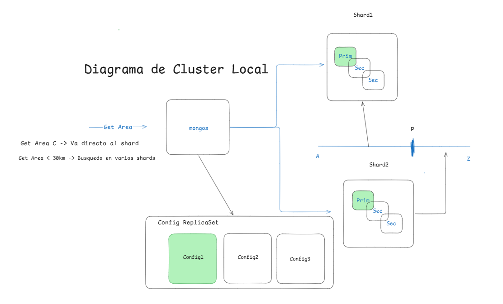
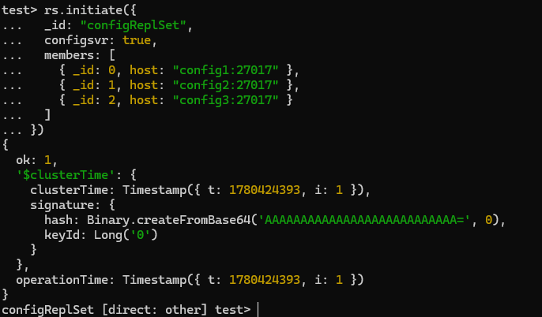
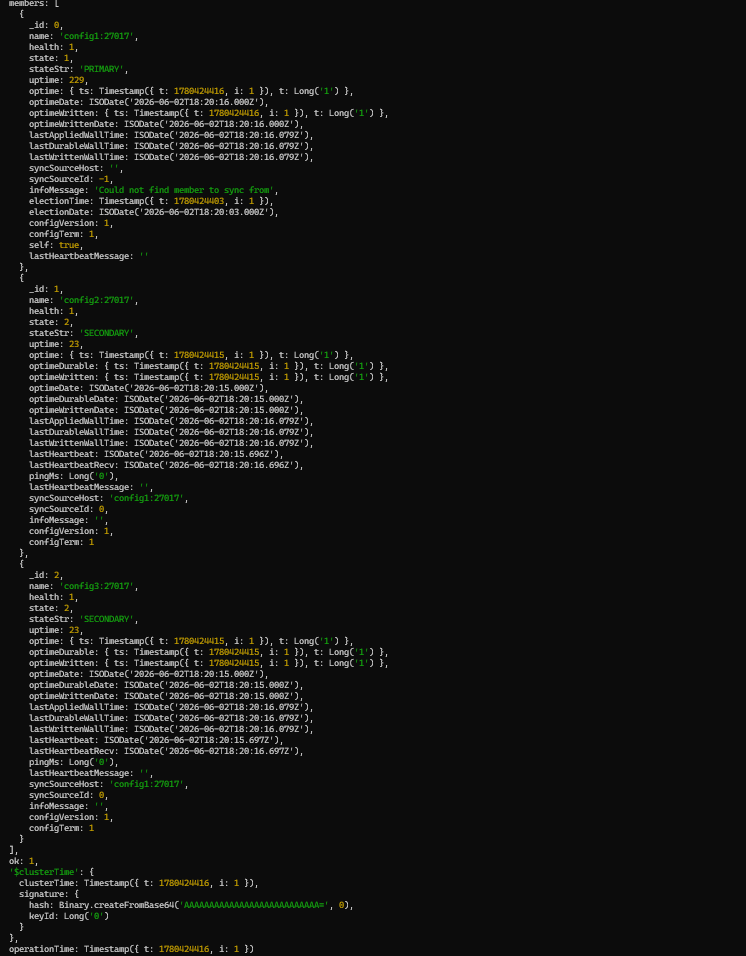
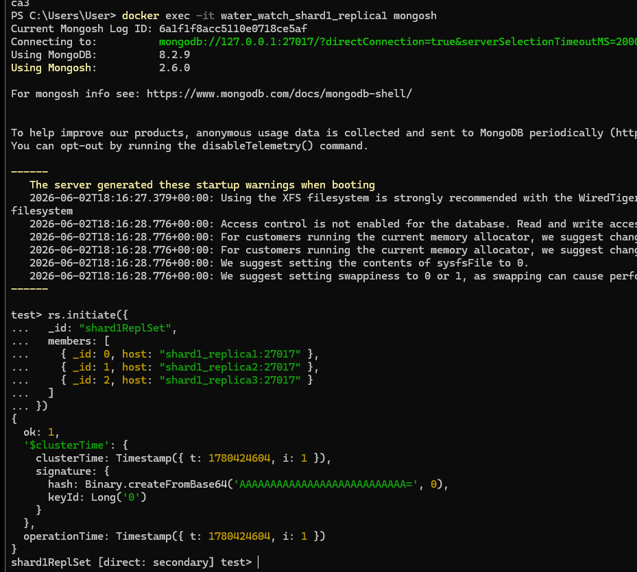
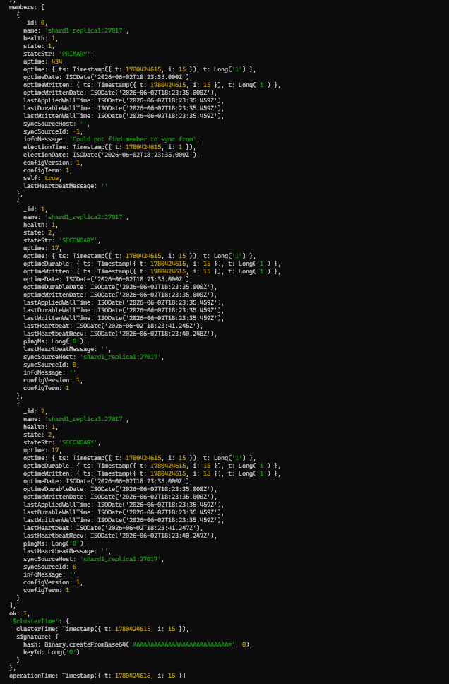
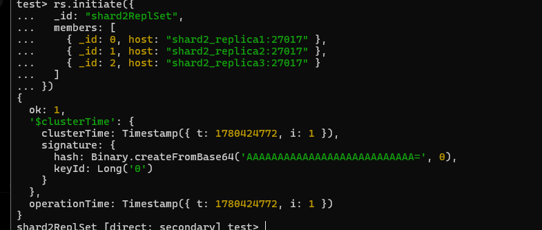
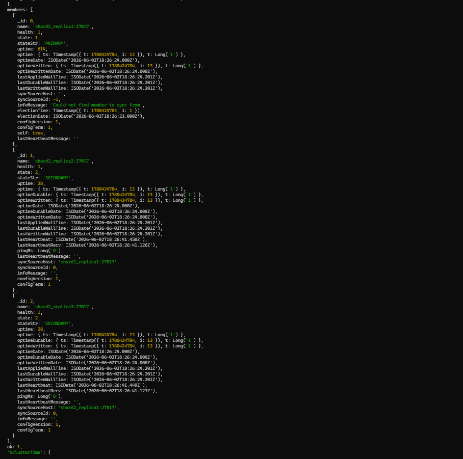
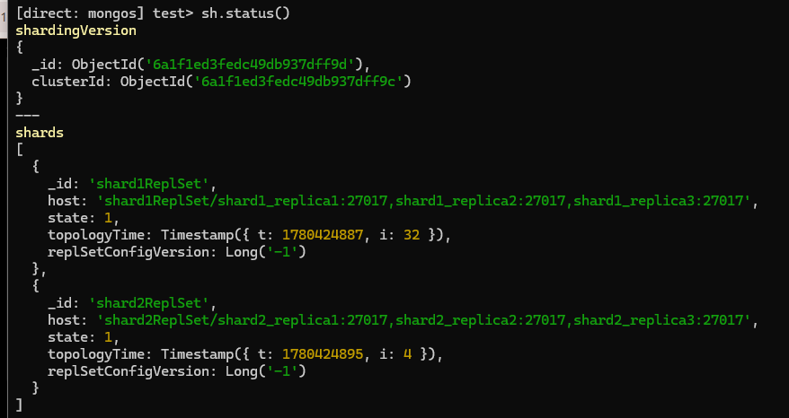
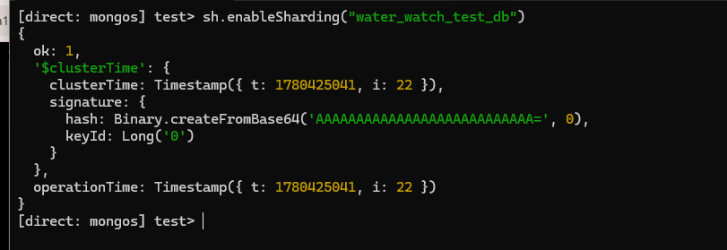
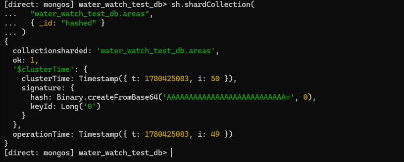

# Cluster MongoDB local

Cluster MongoDB sharded para desarrollo local, levantado con Docker Compose.

---

## Arquitectura



```
Cliente
  └── mongos (puerto 32888)
        ├── Config ReplicaSet  →  config1 (PRIMARY), config2, config3
        ├── Shard 1 ReplicaSet →  shard1_replica1 (PRIMARY), shard1_replica2, shard1_replica3
        └── Shard 2 ReplicaSet →  shard2_replica1 (PRIMARY), shard2_replica2, shard2_replica3
```

| Componente | Contenedores | Rol |
|---|---|---|
| Config ReplicaSet | `config1`, `config2`, `config3` | Almacena metadata del cluster y configuración de shards |
| Shard 1 | `shard1_replica1/2/3` | Almacena datos (1 primary + 2 secondary) |
| Shard 2 | `shard2_replica1/2/3` | Almacena datos (1 primary + 2 secondary) |
| mongos | `water_watch_mongos` | Router de queries — único punto de entrada |

**Colección shardeada:** `areas` · **Shard key:** `{ _id: "hashed" }` · **Índice geoespacial:** `{ geometry: "2dsphere" }`

El sharding por `_id` hashed distribuye los ~34.000 documentos geográficos de forma equilibrada entre ambos shards. El índice `2dsphere` permite consultas geoespaciales (`$geoWithin`, `$near`) dentro de cada shard.

---

## Levantar el cluster

```bash
docker compose -f local/docker-compose-cluster.yml up -d
```

> La primera vez, los replica sets y shards deben inicializarse manualmente con los pasos siguientes.

---

## Inicialización (primera vez)

### Paso 1 — Config ReplicaSet

```bash
docker exec -it water_watch_config1 mongosh
```

```js
rs.initiate({
  _id: "configReplSet",
  configsvr: true,
  members: [
    { _id: 0, host: "config1:27017" },
    { _id: 1, host: "config2:27017" },
    { _id: 2, host: "config3:27017" }
  ]
})
```



Verificar con `rs.status()` — `config1` debe aparecer como `PRIMARY`:



---

### Paso 2 — Shard 1 ReplicaSet

```bash
docker exec -it water_watch_shard1_replica1 mongosh
```

```js
rs.initiate({
  _id: "shard1ReplSet",
  members: [
    { _id: 0, host: "shard1_replica1:27017" },
    { _id: 1, host: "shard1_replica2:27017" },
    { _id: 2, host: "shard1_replica3:27017" }
  ]
})
```



Verificar con `rs.status()` — `shard1_replica1` debe aparecer como `PRIMARY`:



---

### Paso 3 — Shard 2 ReplicaSet

```bash
docker exec -it water_watch_shard2_replica1 mongosh
```

```js
rs.initiate({
  _id: "shard2ReplSet",
  members: [
    { _id: 0, host: "shard2_replica1:27017" },
    { _id: 1, host: "shard2_replica2:27017" },
    { _id: 2, host: "shard2_replica3:27017" }
  ]
})
```



Verificar con `rs.status()` — `shard2_replica1` debe aparecer como `PRIMARY`:



---

### Paso 4 — Agregar shards al cluster y verificar

Conectarse al router `mongos`:

```bash
docker exec -it water_watch_mongos mongosh
```

```js
sh.addShard("shard1ReplSet/shard1_replica1:27017,shard1_replica2:27017,shard1_replica3:27017")
sh.addShard("shard2ReplSet/shard2_replica1:27017,shard2_replica2:27017,shard2_replica3:27017")
sh.status()
```



---

### Paso 5 — Habilitar sharding en la base de datos

Desde `mongos`:

```js
sh.enableSharding("water_watch_test_db")
```



---

### Paso 6 — Shardear la colección `areas`

```js
use water_watch_test_db

db.areas.createIndex({ _id: "hashed" })

sh.shardCollection("water_watch_test_db.areas", { _id: "hashed" })
```



---

### Paso 7 — Índice geoespacial

```js
db.areas.createIndex({ geometry: "2dsphere" })
```

---

## Conexión

```
mongodb://localhost:32888
```

Configurar en `.env.local`:

```
ETL_MONGO_URL=mongodb://localhost:32888
STREAMLIT_MONGO_URL=mongodb://localhost:32888
```

---

## Apagar

```bash
docker compose -f local/docker-compose-cluster.yml down
```

Eliminar también los volúmenes (borra todos los datos):

```bash
docker compose -f local/docker-compose-cluster.yml down -v
```
